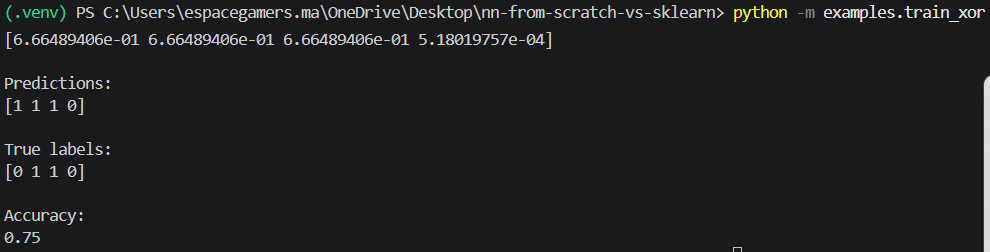
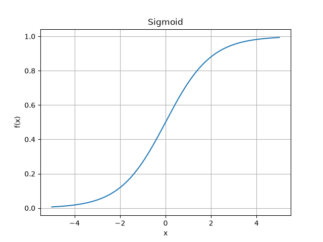
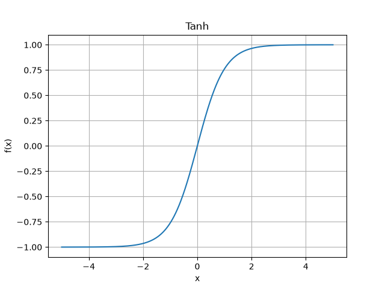
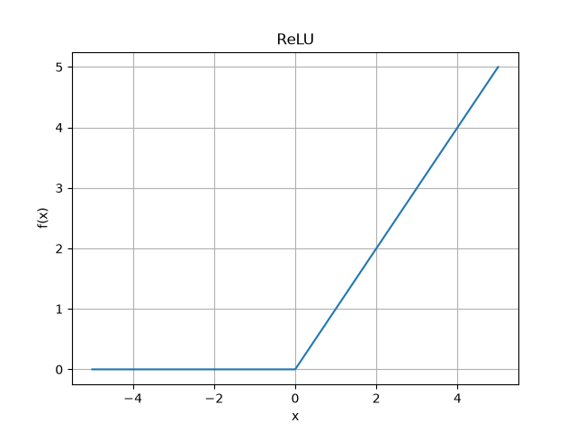
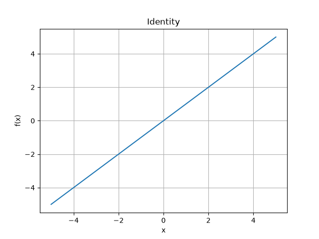
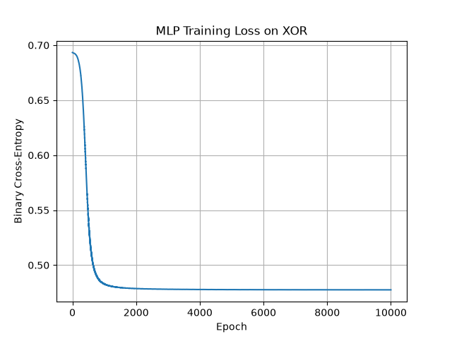
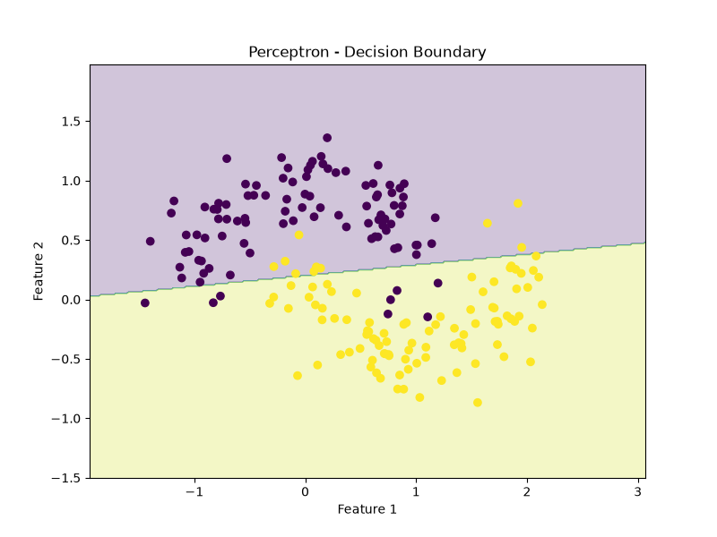
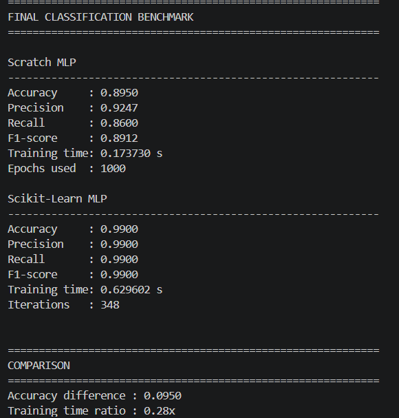

# Neural Networks from Scratch vs Scikit-Learn

> **Implémentation pédagogique de réseaux de neurones artificiels en Python, de zéro avec NumPy, puis comparaison avec les outils Scikit-Learn.**


---

## 1. Présentation

Ce projet a pour objectif de comprendre **comment fonctionnent réellement les réseaux de neurones artificiels** en les implémentant progressivement à partir de zéro, sans utiliser directement les classes de réseaux de neurones de Scikit-Learn pour la partie principale de l'apprentissage.

L'objectif n'est donc pas seulement d'utiliser un modèle existant, mais de comprendre et de programmer les mécanismes fondamentaux :

* neurone artificiel ;
* perceptron ;
* fonctions d'activation ;
* propagation avant (*forward propagation*) ;
* fonctions de perte ;
* rétropropagation (*backpropagation*) ;
* calcul des gradients ;
* descente de gradient ;
* boucle d'entraînement ;
* vérification numérique des gradients ;
* classification ;
* régression ;
* validation croisée ;
* recherche d'hyperparamètres ;
* comparaison avec Scikit-Learn.

Le projet permet ainsi de relier la **théorie mathématique** à une **implémentation concrète en Python/NumPy**.

---

## 2. Objectifs pédagogiques

Les principaux objectifs sont les suivants.

### Comprendre un réseau de neurones

Comprendre comment les données traversent les différentes couches :

```text
Input
   ↓
Hidden Layer
   ↓
Output Layer
```

### Implémenter les algorithmes soi-même

Les composants principaux sont programmés avec NumPy afin de comprendre ce qui se passe derrière les bibliothèques de Machine Learning.

### Comprendre l'apprentissage

Le projet montre comment un réseau :

1. produit une prédiction ;
2. calcule une erreur ;
3. calcule les gradients ;
4. met à jour ses paramètres ;
5. répète le processus jusqu'à apprendre une représentation utile.

### Comparer avec une implémentation industrielle

Les modèles développés from scratch sont ensuite comparés à leurs équivalents Scikit-Learn afin d'observer les différences en termes de :

* performance ;
* optimisation ;
* temps d'entraînement ;
* simplicité d'utilisation ;
* fonctionnalités disponibles.

---

# 3. Architecture du projet

```text
nn-from-scratch-vs-sklearn/
│
├── README.md
├── requirements.txt
│
├── src/
│   ├── __init__.py
│   │
│   ├── engine/
│   │   ├── __init__.py
│   │   ├── activations.py
│   │   ├── losses.py
│   │   ├── perceptron.py
│   │   ├── mlp_classifier.py
│   │   └── mlp_regressor.py
│   │
│   └── pipeline/
│       ├── __init__.py
│       ├── kfold.py
│       ├── stratified_kfold.py
│       ├── cross_validation.py
│       └── grid_search.py
│
├── examples/
│   ├── test_perceptron.py
│   ├── test_activations.py
│   ├── plot_activations.py
│   ├── test_mlp_forward.py
│   ├── test_loss.py
│   ├── test_backpropagation.py
│   ├── test_update.py
│   ├── train_xor.py
│   ├── gradient_check.py
│   ├── train_moons.py
│   ├── compare_perceptron_mlp.py
│   ├── test_kfold.py
│   ├── cross_validate_mlp.py
│   ├── test_stratified_kfold.py
│   ├── stratified_cv_mlp.py
│   ├── cross_validate_generic.py
│   ├── test_grid_generation.py
│   ├── grid_search_mlp.py
│   ├── compare_gridsearch.py
│   ├── final_classification_benchmark.py
│   └── final_regression_benchmark.py
│
├── tests/
│   ├── test_activations.py
│   ├── test_perceptron_unit.py
│   ├── test_losses.py
│   ├── test_mlp.py
│   ├── test_kfold.py
│   ├── test_grid_search.py
│   └── test_regressor.py
│
├── notebooks/
│
└── docs/
    └── images/
```

---

# 4. Environnement utilisé

Le projet a été développé en Python.

### Technologies principales

* **Python**
* **NumPy**
* **Scikit-Learn**
* **Matplotlib**
* **Pytest**

### Installation

Cloner le projet :

```bash
git clone https://github.com/SihamBouzagrar/nn-from-scratch-vs-sklearn.git
cd nn-from-scratch-vs-sklearn
```

Créer l'environnement virtuel :

```bash
python -m venv .venv
```

Activer l'environnement sous Windows :

```powershell
.venv\Scripts\Activate.ps1
```

Installer les dépendances :

```bash
pip install -r requirements.txt
```

---

# 5. Étape 1 — Le neurone artificiel

Un neurone calcule d'abord une combinaison linéaire :

$$
z = XW + b
$$

puis applique une fonction d'activation :

$$
a = f(z)
$$

où :

* \(X\) représente les entrées ;
* \(W\) les poids ;
* \(b\) le biais ;
* \(f\) la fonction d'activation ;
* \(a\) la sortie du neurone.

Cette opération constitue la base de tous les modèles développés dans ce projet.

---

# 6. Étape 2 — Perceptron from Scratch

Le premier modèle implémenté est le **Perceptron**.

Fichier :

```text
src/engine/perceptron.py
```

Le Perceptron utilise une fonction d'activation seuil :

$$
\hat{y} =
\begin{cases}
1 & \text{si } z \ge 0 \\
0 & \text{sinon}
\end{cases}
$$

Les paramètres sont mis à jour lorsqu'une observation est mal classifiée.

### Expériences

Le modèle est testé sur :

* AND ;
* OR ;
* XOR.

### Résultat pédagogique

AND et OR peuvent être représentés par une séparation linéaire.

XOR, en revanche, n'est pas linéairement séparable.

Cela montre une limitation fondamentale du Perceptron et motive l'utilisation des **réseaux multicouches**.

## Résultats du Perceptron

### XOR



---

# 7. Étape 3 — Fonctions d'activation

Les fonctions d'activation sont implémentées dans :

```text
src/engine/activations.py
```

Les fonctions étudiées sont :

### Sigmoid

$$
\sigma(x)=\frac{1}{1+e^{-x}}
$$

Utilisée ici principalement pour la sortie d'une classification binaire.


### Tanh

$$
\tanh(x)
$$


### ReLU

$$
ReLU(x)=\max(0,x)
$$

Utilisée dans les couches cachées des MLP de ce projet.


### Identity

$$
f(x)=x
$$

Utilisée comme fonction d'activation de sortie pour la régression.

Les dérivées correspondantes sont également implémentées afin de permettre la rétropropagation.




---

# 8. Étape 4 — Construction du MLP

Le projet passe ensuite du Perceptron à un **Multi-Layer Perceptron (MLP)**.

Architecture utilisée :

```text
           Input
             │
             ▼
     ┌───────────────┐
     │ Hidden Layer  │
     │     ReLU      │
     └───────────────┘
             │
             ▼
     ┌───────────────┐
     │ Output Layer  │
     │   Sigmoid     │
     └───────────────┘
             │
             ▼
       Prediction
```

Le modèle est implémenté dans :

```text
src/engine/mlp_classifier.py
```

Le MLP contient :

* poids entrée → couche cachée ;
* biais de la couche cachée ;
* poids couche cachée → sortie ;
* biais de sortie.

---

# 9. Étape 5 — Forward Propagation

La propagation avant est réalisée en plusieurs étapes.

### Couche cachée

$$
Z_1 = XW_1+b_1
$$

puis :

$$
A_1 = ReLU(Z_1)
$$

### Couche de sortie

$$
Z_2=A_1W_2+b_2
$$

puis :

$$
A_2=\sigma(Z_2)
$$

La valeur \(A_2\) représente la probabilité prédite par le réseau.


---

# 10. Étape 6 — Fonction de perte

Pour la classification binaire, le projet utilise la **Binary Cross-Entropy** :

$$
L =
-\frac{1}{n}
\sum
[
y\log(\hat{y})
+
(1-y)\log(1-\hat{y})
]
$$

Elle est implémentée dans :

```text
src/engine/losses.py
```

La fonction permet de mesurer la différence entre :

```text
y       → vraie valeur
y_pred  → prédiction du réseau
```

Plus la loss diminue, plus le modèle apprend généralement à reproduire les données d'entraînement.
### MLP Scratch — Training Loss




### Comparaison


---

# 11. Étape 7 — Backpropagation

La rétropropagation constitue le cœur de l'apprentissage.

Elle permet de calculer :

$$
\frac{\partial L}{\partial W}
$$

et :

$$
\frac{\partial L}{\partial b}
$$

pour tous les paramètres du réseau.

Pour la sortie Sigmoid + Binary Cross-Entropy :

$$
\delta_{output}=\hat{y}-y
$$

Puis l'erreur est propagée vers la couche cachée :

$$
\delta_{hidden}
=
\delta_{output}
W_2^T
\odot ReLU'(Z_1)
$$

Les gradients sont ensuite utilisés pour modifier les poids.

---

# 12. Étape 8 — Descente de gradient

Une fois les gradients calculés, les paramètres sont mis à jour selon :

$$
W = W-\eta \frac{\partial L}{\partial W}
$$

où :

$$
\eta
$$

représente le **learning rate**.

Le processus complet devient :

```text
Forward
   ↓
Loss
   ↓
Backward
   ↓
Gradients
   ↓
Update
   ↓
Forward
   ↓
...
```

Cette boucle est répétée pendant un nombre donné d'epochs.

---

# 13. Étape 9 — Gradient Checking

Pour vérifier que les dérivées analytiques sont correctement implémentées, une vérification numérique des gradients a été réalisée.

Le gradient numérique est approximé avec :

$$
\frac{\partial L}{\partial \theta}
\approx
\frac{
L(\theta+\epsilon)
-
L(\theta-\epsilon)
}{
2\epsilon
}
$$
## Résultats du Grid Search

### Grid Search from Scratch


### Scikit-Learn GridSearchCV


### Comparaison


---

# 14. Étape 10 — Classification avec Make Moons

Pour tester la capacité du MLP à apprendre une frontière non linéaire, le projet utilise le dataset :

```python
sklearn.datasets.make_moons
```

Le pipeline est :

```text
Dataset
   ↓
Train / Test Split
   ↓
StandardScaler
   ↓
MLP
   ↓
Prediction
   ↓
Metrics
```

Les performances sont évaluées avec :

* Accuracy ;
* Precision ;
* Recall ;
* F1-score.
Le modèle permet de dépasser les limites du Perceptron sur des données non linéaires.

Le modèle permet de dépasser les limites du Perceptron sur des données non linéaires.


### Frontière de décision du Preceptron



### Frontière de décision du MLP


---

# 15. Étape 11 — Perceptron vs MLP

Une comparaison directe a été réalisée entre :

```text
Perceptron
      vs
MLP
```

sur le même problème de classification.

Cette expérience permet de mettre en évidence la différence entre :

### Perceptron

```text
Input
  ↓
Output
```

et :

### MLP

```text
Input
  ↓
Hidden Layer
  ↓
Output
```

La couche cachée et les fonctions d'activation permettent au MLP de modéliser des relations non linéaires.


---

# 16. Étape 12 — K-Fold Cross-Validation

Une implémentation personnelle de K-Fold a ensuite été développée :

```text
src/pipeline/kfold.py
```

L'idée consiste à diviser les données en plusieurs folds.

Pour :

```text
K = 5
```

on obtient :

```text
Fold 1 → validation
Fold 2 → validation
Fold 3 → validation
Fold 4 → validation
Fold 5 → validation
```

Chaque fold sert une fois de validation tandis que les autres servent à l'entraînement.

La performance finale est obtenue à partir de la moyenne des scores.

---

# 17. Étape 13 — Stratified K-Fold

Pour les problèmes de classification, une version stratifiée a également été développée :

```text
src/pipeline/stratified_kfold.py
```

L'objectif est de conserver approximativement la même proportion des classes dans chaque fold.

Cela est particulièrement utile lorsque les classes ne sont pas parfaitement équilibrées.


---

# 18. Étape 14 — Prévention du Data Leakage

Une attention particulière est portée à la préparation des données pendant la cross-validation.

Le principe utilisé est :

```text
Training fold
     ↓
fit scaler
     ↓
transform training data

Test fold
     ↓
transform uniquement
```

Le scaler n'est jamais ajusté sur le fold de validation.

Cela évite que des informations du jeu de validation contaminent l'apprentissage.

Le même principe est appliqué pendant la validation croisée générique.

---

# 19. Étape 15 — Grid Search from Scratch

Une implémentation de recherche d'hyperparamètres a été développée dans :

```text
src/pipeline/grid_search.py
```

Le principe consiste à tester plusieurs combinaisons de paramètres.

Exemple :

```python
param_grid = {
    "learning_rate": [0.001, 0.01, 0.05],
    "hidden_layer_size": [4, 8, 16],
    "epochs": [1000, 3000],
}
```

Toutes les combinaisons sont évaluées avec la validation croisée.

Pour chaque combinaison, le système calcule :

* score moyen ;
* écart-type ;
* scores par fold.

La meilleure combinaison est ensuite sélectionnée.

---

# 20. Étape 16 — Grid Search Scratch vs Scikit-Learn

Le projet compare ensuite deux approches :

```text
GridSearchScratch
       vs
GridSearchCV
```

L'objectif n'est pas de faire passer notre modèle Scratch comme un estimateur Scikit-Learn, mais de comparer :

```text
Notre implémentation
        vs
Implémentation mature
```

Pour cette comparaison, le MLP développé from scratch est évalué avec son propre `GridSearchScratch`, tandis que Scikit-Learn utilise directement :

```python
sklearn.model_selection.GridSearchCV
```

avec :

```python
sklearn.neural_network.MLPClassifier
```

Cette distinction permet de conserver la séparation entre la partie pédagogique et la partie framework.


---

# 21. Étape 17 — Classification Benchmark

Le benchmark final de classification compare :

```text
MLPClassifierScratch
        vs
sklearn.neural_network.MLPClassifier
```

Le benchmark mesure notamment :

* Accuracy ;
* Precision ;
* Recall ;
* F1-score ;
* temps d'entraînement ;
* nombre d'itérations ;
* évolution de la loss.

Les deux modèles travaillent sur le même problème et sur les mêmes données de test.




---

# 22. Étape 18 — Régression avec MLPRegressorScratch

Le projet ne se limite pas à la classification.

Un deuxième réseau a été développé pour résoudre des problèmes de **régression** :


Architecture :

```text
Input
   ↓
Hidden Layer
ReLU
   ↓
Output Layer
Identity
   ↓
Continuous Value
```

Contrairement à la classification binaire, la sortie n'est pas une probabilité.

Elle représente directement une valeur continue.

---

# 23. Fonction de perte pour la régression

La régression utilise la **Mean Squared Error (MSE)** :

$$
MSE =
\frac{1}{n}
\sum_{i=1}^{n}
(y_i-\hat{y}_i)^2
$$

La fonction est implémentée dans :

```text
src/engine/losses.py
```

Le MLP Regresor utilise :

```text
ReLU
```

dans la couche cachée et :

```text
Identity
```

dans la couche de sortie.

---

# 24. Backpropagation pour la régression

Pour la MSE :

$$
\frac{\partial L}{\partial \hat{y}}
=
\frac{2}{n}
(\hat{y}-y)
$$

Comme l'activation de sortie est Identity :

$$
Identity'(x)=1
$$

la dérivée de la sortie est directement transmise à la couche précédente.

Le processus d'apprentissage reste donc :

```text
Forward
   ↓
MSE
   ↓
Backward
   ↓
Gradients
   ↓
Gradient Descent
   ↓
Update
```

---

# 25. Classification vs Régression

Le projet permet ainsi de comparer les deux usages fondamentaux des MLP.

| Élément           | Classification       | Régression          |
| ----------------- | -------------------- | ------------------- |
| Modèle            | MLPClassifierScratch | MLPRegressorScratch |
| Sortie            | Probabilité          | Valeur continue     |
| Activation sortie | Sigmoid              | Identity            |
| Loss              | Binary Cross-Entropy | MSE                 |
| Prediction        | Classe 0/1           | Valeur réelle       |
| Exemple           | Make Moons           | Make Regression     |

Cette différence permet de comprendre comment la **fonction de sortie** et la **fonction de perte** dépendent du type de problème.


---

# 26. Scikit-Learn comme référence

Après les implémentations from scratch, les modèles sont comparés avec les équivalents Scikit-Learn :

### Classification

```python
from sklearn.neural_network import MLPClassifier
```

### Régression

```python
from sklearn.neural_network import MLPRegressor
```

L'objectif n'est pas de reproduire exactement le fonctionnement interne de Scikit-Learn.

L'objectif est plutôt de comprendre pourquoi une bibliothèque mature offre généralement :

* davantage d'optimisations ;
* plusieurs solveurs ;
* davantage de paramètres ;
* une API standardisée ;
* de meilleures performances dans de nombreux cas pratiques.

---

# 27. Organisation du code

## Engine

Le dossier :

```text
src/engine/
```

contient les composants fondamentaux du Machine Learning :

```text
activations.py
losses.py
perceptron.py
mlp_classifier.py
mlp_regressor.py
```

## Pipeline

Le dossier :

```text
src/pipeline/
```

contient les outils permettant d'évaluer et de sélectionner les modèles :

```text
kfold.py
stratified_kfold.py
cross_validation.py
grid_search.py
```

## Examples

Le dossier :

```text
examples/
```

contient les expériences et démonstrations.

## Tests

Le dossier :

```text
tests/
```

contient les tests unitaires et fonctionnels.

---

# 28. Tests

Les tests sont réalisés avec Pytest.

Lancer l'ensemble des tests :

```bash
python -m pytest -v
```

Les tests couvrent notamment :

* fonctions d'activation ;
* pertes ;
* Perceptron ;
* MLP ;
* K-Fold ;
* Grid Search ;
* régression.

---

# 29. Expériences principales

Le projet peut être parcouru dans l'ordre suivant :

```text
01. Perceptron
        ↓
02. Activation Functions
        ↓
03. MLP Forward Propagation
        ↓
04. Loss Functions
        ↓
05. Backpropagation
        ↓
06. Gradient Descent
        ↓
07. Gradient Checking
        ↓
08. Classification
        ↓
09. K-Fold
        ↓
10. Stratified K-Fold
        ↓
11. Cross-Validation
        ↓
12. Grid Search
        ↓
13. Classification Benchmark
        ↓
14. Regression
        ↓
15. Regression Benchmark
        ↓
16. Tests
```

---

# 30. Principales compétences mobilisées

Ce projet permet de mettre en pratique plusieurs notions de Machine Learning et de programmation scientifique.

### Machine Learning

* Artificial Neuron
* Perceptron
* MLP
* Forward Propagation
* Backpropagation
* Gradient Descent
* Loss Functions
* Classification
* Regression
* Cross-Validation
* Hyperparameter Tuning

### Mathématiques

* Algèbre linéaire
* Produit matriciel
* Dérivées
* Gradient
* Règle de la chaîne
* Optimisation

### Python

* NumPy
* programmation orientée objet
* modularisation
* tests unitaires
* gestion d'environnement virtuel

### Machine Learning Engineering

* séparation engine / pipeline / examples / tests ;
* reproductibilité avec `random_state` ;
* prévention du data leakage ;
* validation expérimentale ;
* comparaison d'implémentations.

---

# 31. Ce que j'ai appris à travers ce projet

La réalisation de ce projet permet de comprendre qu'un réseau de neurones n'est pas une boîte noire.

Même si les bibliothèques modernes permettent d'entraîner un modèle en quelques lignes, son fonctionnement repose sur plusieurs mécanismes fondamentaux :

```text
Weighted Sum
      ↓
Activation
      ↓
Prediction
      ↓
Loss
      ↓
Gradient
      ↓
Parameter Update
      ↓
Learning
```

L'implémentation from scratch permet notamment de comprendre le rôle de chaque matrice, chaque biais, chaque fonction d'activation et chaque dérivée dans le processus d'apprentissage.

---

# 32. Limites de l'implémentation

Cette implémentation est volontairement pédagogique.

Elle ne cherche pas à reproduire toutes les fonctionnalités des frameworks industriels.

Parmi les simplifications :

* une architecture principalement composée d'une couche cachée ;
* entraînement par Batch Gradient Descent ;
* nombre d'epochs fixé ;
* peu d'options d'optimisation ;
* pas de GPU ;
* pas de mini-batch training avancé ;
* pas de régularisation avancée ;
* nombre limité de fonctions d'activation ;
* API volontairement simple.

Ces limitations sont assumées car le but principal du projet est la compréhension des mécanismes internes.

---

# 33. Améliorations possibles

Plusieurs extensions pourraient être ajoutées :

* plusieurs couches cachées ;
* Softmax pour la classification multiclasse ;
* mini-batch gradient descent ;
* Momentum ;
* Adam ;
* L2 Regularization ;
* Dropout ;
* Early Stopping ;
* Batch Normalization ;
* classification multiclasse ;
* visualisation interactive des frontières de décision ;
* comparaison de plusieurs optimiseurs.

---


### Classification Benchmark

```text
Model A → MLPClassifierScratch
Model B → Scikit-Learn MLPClassifier

Metrics:
- Accuracy
- Precision
- Recall
- F1
- Training Time
```

### Regression Benchmark

```text
Model A → MLPRegressorScratch
Model B → Scikit-Learn MLPRegressor

Metrics:
- MSE
- MAE
- R²
- Training Time
```

---

# 36. Conclusion

Ce projet constitue une implémentation progressive d'un réseau de neurones artificiels, depuis le Perceptron jusqu'aux architectures MLP utilisées pour la classification et la régression.

L'intérêt principal du projet est de combiner :

```text
Théorie
   +
Mathématiques
   +
NumPy
   +
Machine Learning
   +
Tests
   +
Validation
   +
Benchmark
   +
Scikit-Learn
```

La démarche permet de comprendre ce qui se passe **à l'intérieur d'un réseau de neurones**, avant d'utiliser des frameworks de haut niveau.

---

# 37. Auteur

**Siham Bouzagrar**

Étudiante en ingénierie — EHTP
Orientation : SIG / Data Science / Développement logiciel


